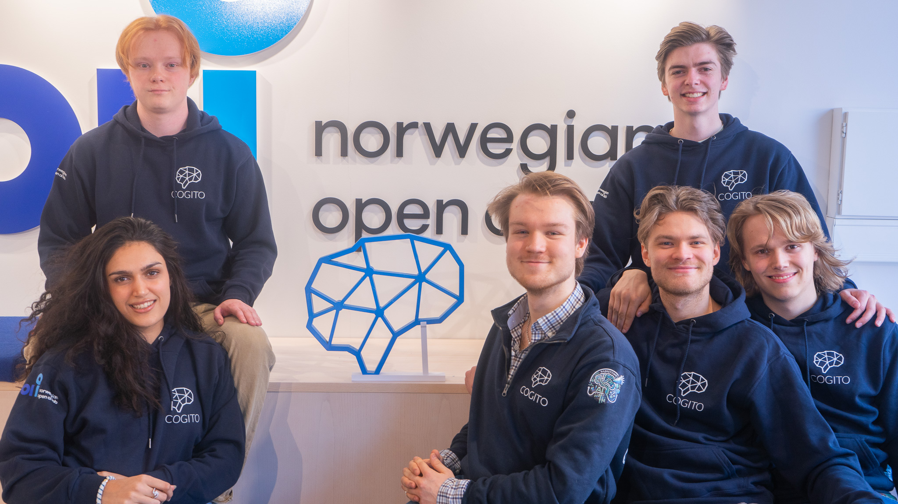

# TutorAI

<div align="center">


[](https://opensource.org/licenses/MIT)
[](https://img.shields.io/badge/version-1.0.0-blue)


</div>

<details> 
<summary><b>📋 Table of contents </b></summary>

- [TutorAI](#tutorai)
  - [Introduction](#introduction)
    - [Features](#features)
  - [Quick Start](#quick-start)
    - [Prerequisites](#prerequisites)
    - [Clone the repository](#clone-the-repository)
    - [Configuration](#configuration)
    - [Usage](#usage)
  - [📖 Documentations](#-documentations)
  - [Contributors](#contributors)
  - [License](#license)

</details>

## Introduction
TutorAI is an interactive language agent designed to assist with learning academic subjects. It facilitates efficient learning by allowing users to upload textbooks in various formats and interact with the course material.

### Features
TutorAI offers a comprehensive set of features to enhance the learning experience:

- **Document upload**: Upload course material in various formats to enable TutorAI to process and interact with the content. Supported formats include PDF, DOC, DOCX, PNG, JPG, JPEG, PPM, TIFF, BMP, and more.
- **Information search**: Retrieve relevant citations and incorporate them into responses to user questions. This ensures comprehensive, accurate, and well-cited information, enhancing the learning process.
- **Learning plans**: Tailored to the user's pace, style, and goals, offering structured paths to mastery.
- **Flashcards and Memory aids**: Enhance memory retention with customizable digital flashcards, exportable to Anki and Quizlet.
- **Quiz and test generation**: Automatically generate quizzes and tests based on the uploaded material.
- **Quiz and test grading**: Receive automatic grading and feedback on quizzes and tests to track progress and identify improvement areas.
- **Compendium**: Generate a summary of the uploaded material, making it easier to review and understand the content.
- **Study streaks**: Motivate regular engagement with learning material through gamified elements, making education a daily habit, and exams passed easily.

## Quick Start

### Prerequisites
- Ensure that git is installed on your machine. [Download Git](https://git-scm.com/downloads)
- Docker is used for the backend and database setup. [Download Docker](https://www.docker.com/products/docker-desktop)

### Clone the repository

```bash
git clone https://github.com/CogitoNTNU/TutorAI.git
cd TutorAI
```

### Configuration
Create a `.env` file in the root directory of the project and add the following environment variables:

```bash
OPENAI_API_KEY = 'your_openai_api_key'
MONGODB_URI = 'your_secret_key'
```

Optionally, you can add the following environment variables to customize the project:

```bash
GPT_MODEL = 'gpt-3.5-turbo' # OpenAI model to use
```


### Usage
To start TutorAI, run the following command in the root directory of the project:

```bash
docker compose up --build
```

Then navigate to `http://localhost:3000` in your browser to access the UI of the frontend.

To access the backend, navigate to `http://localhost:8000` in your browser.

## 📖 Documentations

- [Developer Setup Guild](docs/manuals/setup)
- [Testing](docs/manuals/testing.md)
- [Architecture](docs/architecture/architectural_design.md)

## Contributors

<table align="center">
  <tr>
    <td align="center">
        <a href="https://github.com/henrik392">
            <br />
            <sub><b>Henrik Halvorsen Kvamme</b></sub>
        </a>
    </td>
    <td align="center">
        <a href="https://github.com/kaamyashinde">
            <br />
            <sub><b>Kaamya Shinde</b></sub>
        </a>
    </td>
    <td align="center">
        <a href="https://github.com/Knolaisen">
            <br />
            <sub><b>Kristoffer Nohr Olaisen</b></sub>
        </a>
    </td>
    <td align="center">
        <a href="https://github.com/olavsl">
            <br />
            <sub><b>Olav Selnes Lorentzen</b></sub>
        </a>
    </td>
    <td align="center">
      <a href="https://github.com/Parleenb">
          <br />
          <sub><b>Parleen Brar</b></sub>
      </a>
    </td>
    <td align="center">
      <a href="https://github.com/sandviklee">
          <br />
          <sub><b>Simon Sandvik Lee</b></sub>
      </a>
    </td>
    <td align="center">
        <a href="https://github.com/LockedInTheSkage">
            <br />
            <sub><b>Skage  Reistad</b></sub>
        </a>
    </td>
    <td align="center">
        <a href="https://github.com/SverreNystad">
            <br />
            <sub><b>Sverre Nystad</b></sub>
        </a>
    </td>
    <td align="center">
      <a href="https://github.com/tobiasfremming">
          <br />
          <sub><b>Tobias Fremming</b></sub>
      </a>
    </td>
  </tr>
</table>

This project would not have been possible without the hard work and dedication of all of the contributors. Thank you for the time and effort you have put into making TutorAI a reality.

<div align="center">
    
</div>


## License
Licensed under the [MIT License](LICENSE).
